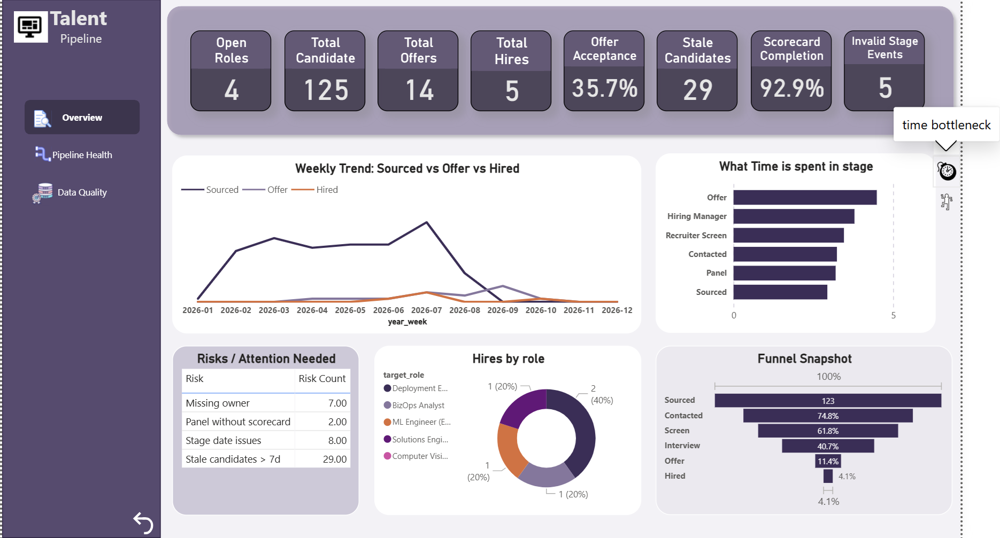
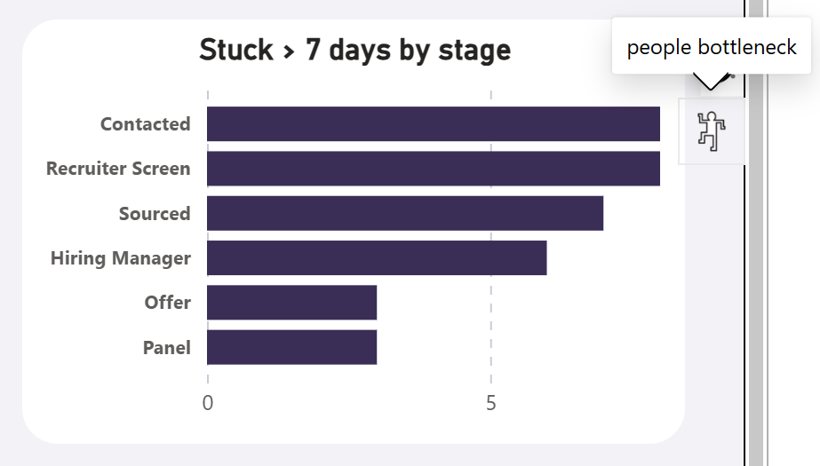
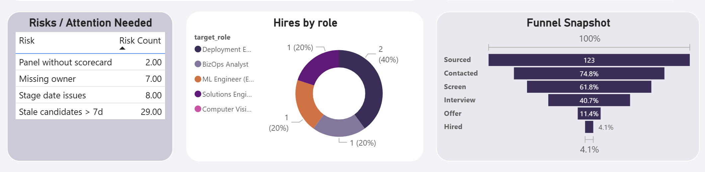
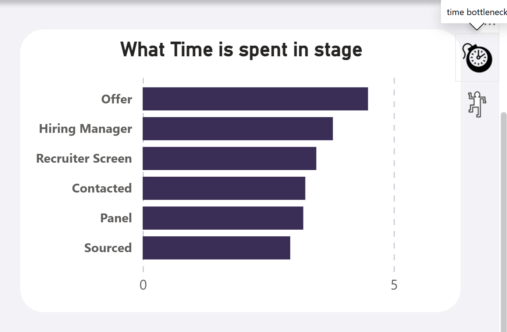

# Talent Pipeline

A small, realistic Talent Ops analytics MVP that simulates an ATS-style pipeline using **synthetic/mock data**, loads it into **SQLite**, computes **funnel + speed + process-quality KPIs** via **SQL + Python**, and visualizes results in **Power BI** (shared as screenshots).

## What this project demonstrates
- Designing a pipeline-style dataset (candidates + stage events + scorecards)
- Building a small analytics-ready system: **CSV → SQLite → KPI queries → reporting datasets**
- Data hygiene / reporting quality checks (missing fields, duplicates, invalid stages, date issues, scorecard gaps)
- Executive-style reporting (funnel, trends, bottlenecks)

## Repository structure
- `data/raw/` – generated mock CSVs (candidates, pipeline events, scorecards, roles, market map)
- `sql/` – schema + KPI queries (funnel, stage aging, hygiene checks)
- `scripts/` – generators + loaders + KPI/report exporters
- `data/processed/` – report-ready CSV outputs for Power BI
- `dashboards/screenshots/` – Power BI dashboard screenshots

## Dashboard (Power BI)

### Executive Overview


### Focused views







## How to run (end-to-end)
### 1) Setup
```bash
conda create -n talentops python=3.11 -y
conda activate talentops
pip install -r requirements.txt
```

### 2)Generate mock data (writes to data/raw/)
```bash
python -m scripts.generate_mock_data
```
### 3) Load to SQLite (creates talentops.db)
```bash
python scripts/load_to_sqlite.py
```

### 4) Export report-ready outputs (writes to data/processed/)
```bash
python scripts/export_reports.py
```
